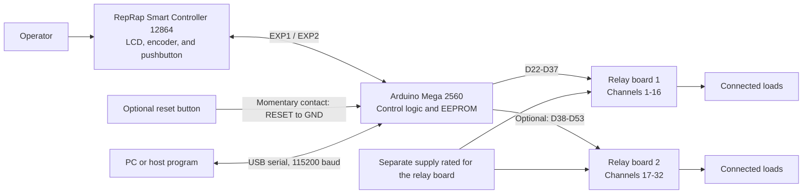
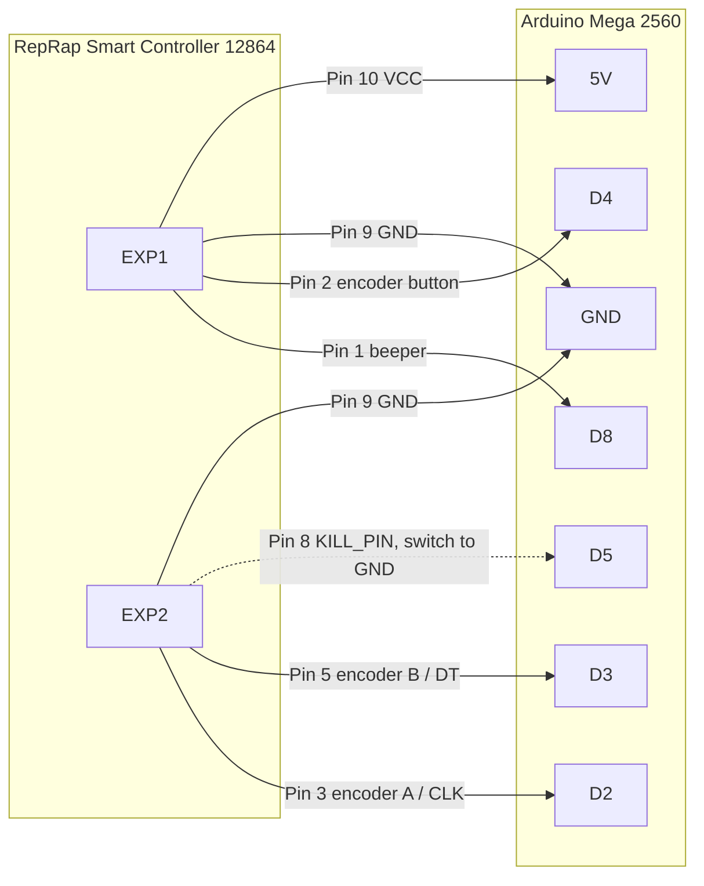

# Arduino Relay Controller with LCD

A local control panel for up to 32 relay channels. An Arduino Mega switches the relays, an LCD shows the commanded output states, and a rotary encoder provides local control. Channels can also be controlled over USB serial. The project does not require a network or cloud service.

There is no electrical feedback from the relay contacts. The display shows the state requested by the firmware, not whether a contact physically changed state.

## System Overview



The Mega reads the encoder, updates the display, and drives the relay inputs. The active channel count and channel numbering base are stored in EEPROM. One 16-channel relay board is needed for a 16-channel setup; a second board is optional for 32 channels.

## Components

| Component | Purpose |
| --- | --- |
| Arduino Mega 2560 | Controls the display, input, and up to 32 relay outputs |
| RepRap Smart Controller 12864 (5 V, ST7920) | Combines the graphic LCD, rotary encoder, and pushbutton; a separate encoder is not needed |
| External reset pushbutton (optional) | Resets the Mega when connected between RESET and GND |
| One or two 16-channel relay boards | Switches the connected loads |
| Separate, correctly rated power supply | Powers the relay coils as specified by the board manufacturer |
| USB connection to a PC (optional) | Uploads firmware and provides 115200-baud serial control |

## What You Can Do

- Select, switch, and monitor individual channels using the rotary encoder and LCD.
- Choose 16 or 32 active channels; the setting persists across power cycles.
- Number channels from 0 or 1 to match an external control program.
- Run a relay test that turns all active channels on, then turns them off one at a time at one-second intervals.
- Control channels from a serial terminal or a host program over USB.

This project does not provide scheduling, sensor input, or network control. It is intended for manual or serial relay control.

## Hardware and Pinout

| Function | Mega pin |
| --- | ---: |
| Relays 1-8 | D22-D29 |
| Relays 9-16 | D30-D37 |
| Relays 17-24 | D38-D45 |
| Relays 25-32 | D46-D53 |
| Display beeper (EXP1 pin 1) | D8 |
| Display KILL button (EXP2 pin 8) | D5, switch to GND |
| Optional reset button | Mega RESET to GND |
| Smart Controller EXP1 / EXP2 | See wiring diagram below |

Connector orientation and signal assignments can vary between display revisions; use the pin numbers and labels on your exact module, not its apparent left-to-right orientation in a drawing. Your shown pinout labels EXP1 pins 3-5 as NC and pins 6-7 as DOGLCD_CS / DOGLCD_A0. The sketch currently uses the U8g2 ST7920 driver with display signals on Mega D11-D13, so its LCD wiring is not verified for this module. Do not connect LCD signals using the generic diagram until the display controller and driver wiring are confirmed. The shown EXP1 pin 8 is NC, not RESET. Use a separate normally-open button between Mega RESET and GND if a hardware reset button is needed; never connect RESET to 5 V.



The SD-card signals are not used. When present, the beeper connects to D8 and sounds on accepted encoder-button presses. The EXP2 KILL button connects to D5 and GND; pressing it turns all active relays on if any are off, or turns them all off if they are already on. This is not an emergency stop; use a separate hardware cutoff for the relay supply. See [doc/pinout_display](doc/pinout_display) for connector details and wiring notes.

## Operation

In the relay grid, turn the encoder to select a channel and press it briefly to toggle that relay. Hold the pushbutton for 5 seconds to open or close the menu. Turn the encoder to select a menu item and press briefly to change the channel count or numbering base, start the relay test, or return to the grid.

The relay test turns all active channels on, then turns off the next channel once per second. Pressing the button cancels the test and turns off the remaining channels. The channel count and numbering base are saved in EEPROM.

## Serial Commands

Use 115200 baud and send one command per line. With channel numbering starting at 1:

```text
1,2,12:ON
12:OFF
all:OFF
```

With numbering starting at 0, address channels `0` through `15` or `0` through `31`. `all:ON` turns on every channel enabled in EEPROM; `all:OFF` turns them off. Use `all:ON` only when the contacts are safely wired and the supply is rated for all relay coils.

## Build and Upload

PlatformIO installs U8g2 as configured in `platformio.ini`. The default profile is `mega16`:

```sh
pio run
pio run -e mega16
pio run -e mega32
pio run -e mega16 -t upload --upload-port /dev/ttyACM0
```

Both profiles build firmware for the same Arduino Mega 2560. `RELAY_COUNT` is only the default when no valid channel count is stored in EEPROM; otherwise, the saved menu setting takes precedence. In the Arduino IDE, install U8g2 and set `RELAY_COUNT` to `16` or `32` if needed.

## 3D-Printed Parts

The STL files are in `stl/`:

- `Arduino Relais box arduino.stl`
- `Arduino Relais box card.stl`
- `Arduino Relais box cover.stl`

For a 16-relay setup, print the card-box part once. For 32 relays, print `Arduino Relais box card.stl` twice and stack the two card-box modules together to accommodate both relay boards. The Arduino and cover parts are also available as separate STL files. Import the models into a slicer; material, orientation, and print settings depend on your printer.

## Safety

The firmware uses active-low relay inputs: LOW means ON and HIGH means OFF. Do not power relay coils from the Mega's 5 V pin; use a separate supply rated for the relay board. Check the trigger jumper and input circuit on your specific board before wiring it. Use mains voltage only with suitable insulation, fusing, an enclosure, and strain relief. Keep the relay contacts unloaded during initial tests whenever possible.
